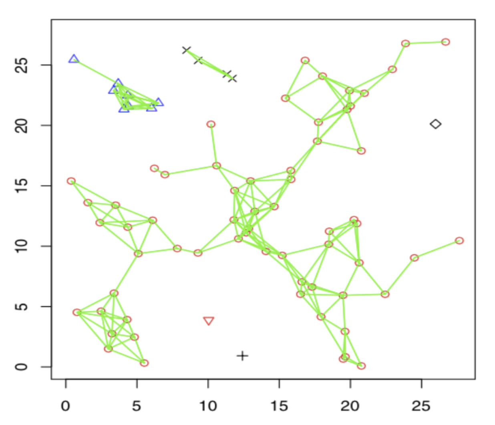
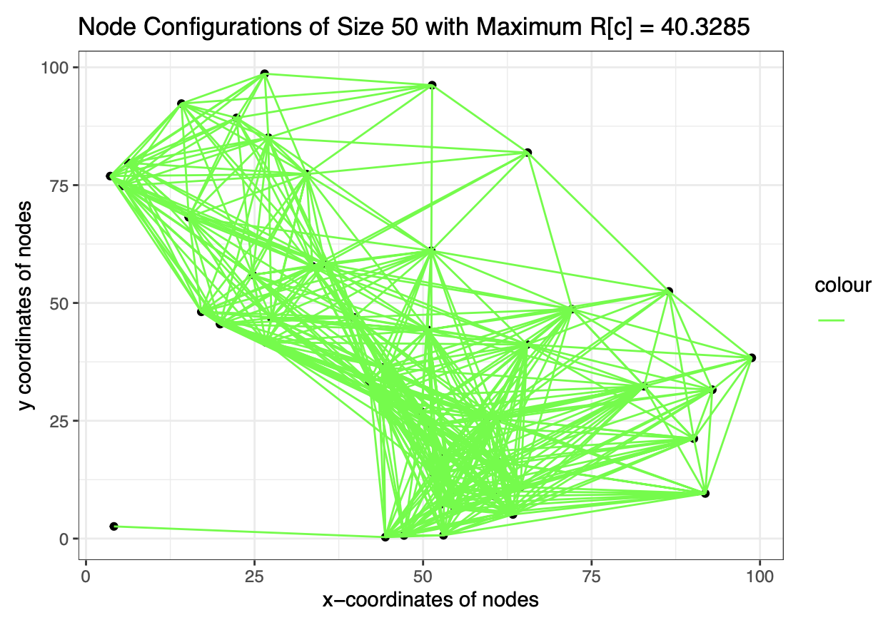
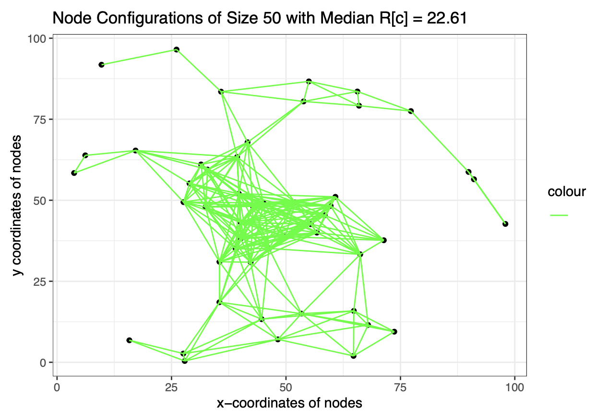
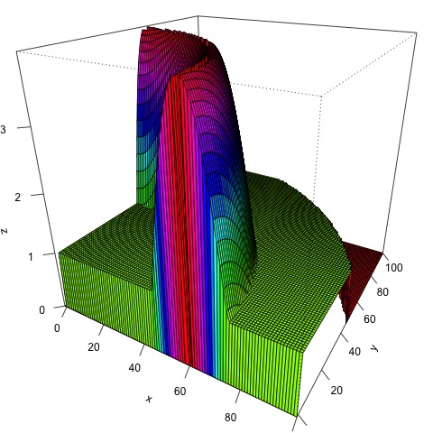
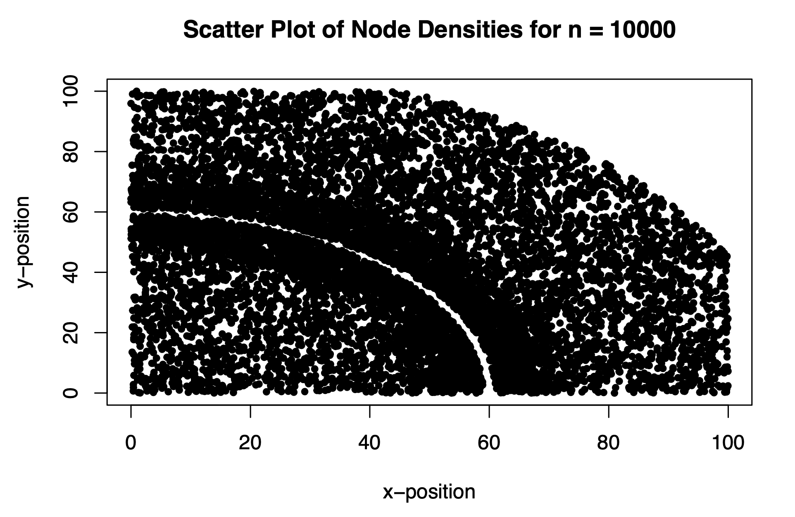
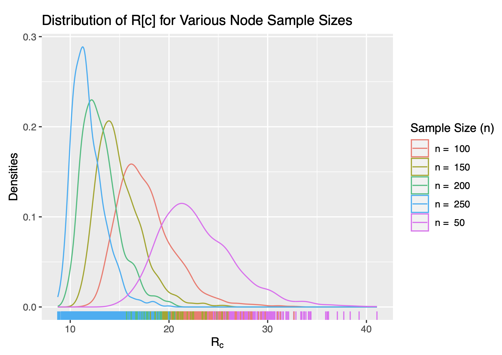
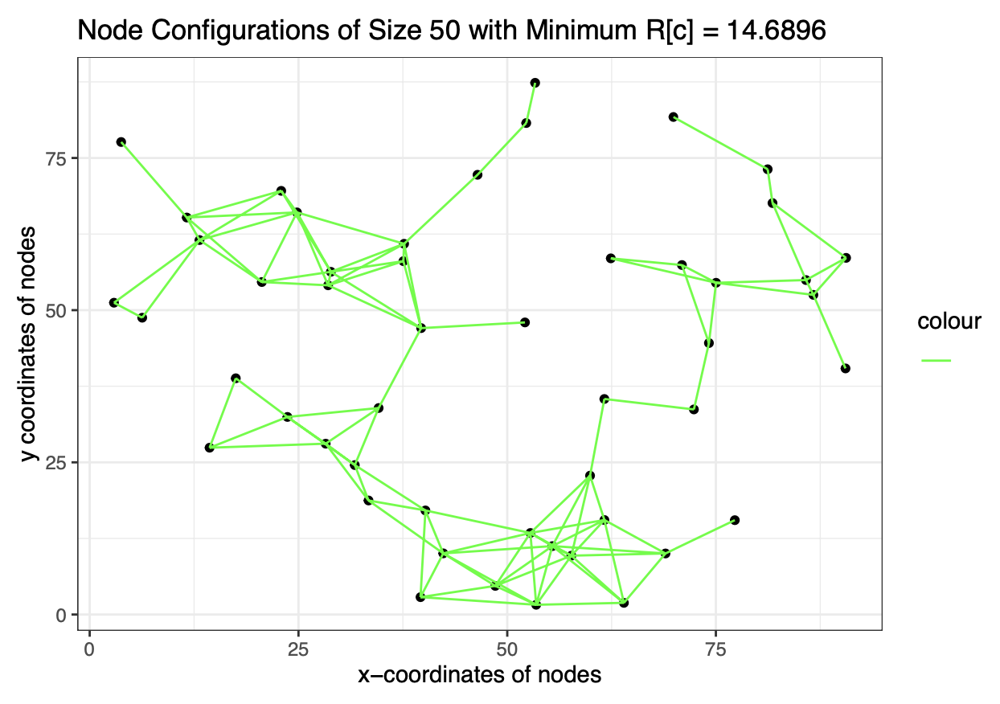
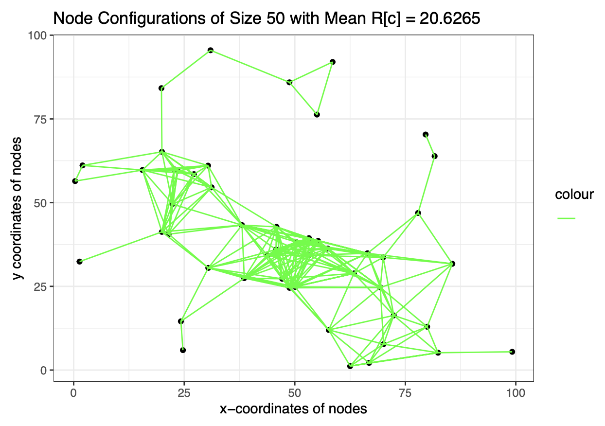

# Ad hoc Network (STAT 302 Final Project)

The project specifications are provided in the downloadable pdf below:

[STAT 302 Final Project Description](https://raw.githubusercontent.com/zhangyk8/zhangyk8.github.io/master/_teaching/file_stat302/Lectures/Final_Project.pdf)

# What is an Ad hoc Network?

- Nowadays, we rely on our cell phones to receive messages and communicate with others around the world

- Traditionally, cell phones needed to communicate with a nearby base station to send and receive calls

  - More specifically, calls are relayed from base station to base station as our cell phone moves
 
  - This can influence the quality of our phone calls when we're far away from the nearest base station

- The **ad hoc wireless network** instead relays messages via other devices in the network

  - A message hops from one device to the next until it reaches its destination

  - There are no centralized nodes or fixed structures (such as routers)
  
  - Devices can dynamically enter and exit the network

## Examples of the Ad Hoc Network

- Above is an **ad hoc wireless network** with 6 disconnected clusters/components

  - *Note that each node corresponds to an arbitrary device in (x, y) space*

  - *Line segments (and the node shape) signify connected nodes in the network*

  - In this case, all nodes within $3.75 \text{ units}$ of each other are connected

- Above is an **ad hoc wireless network** with 0 disconnected clusters/components (fully connected)

  - In this case, $\text{maximum } R_c = 40.3285$ such that nodes within $40.3285 \text{ units}$ of each other are connected
 
  - For these devices, $40.3285$ is the minimum line segment length necessary for a fully connected network

    - (i.e. if $\text{maximum } R_c < 40.3285$, then the node at the very bottom near (0, 0) would be disconnected)

# Connected Ad Hoc Network

- An **ad hoc network** is *connected* if any abitrary node can traverse across line segments to reach all nodes

  - In non technical terms, a network is *connected* if any device can communicate with any device it desires
 
  - This is what we want for our communication systems!

- So, it shouldn't be surprising that we are interested in connected networks

  - Specifically, we are interested in the minimum device range necessary to create a connected path
 
## Goal

- Given a particular configuration of nodes, we want to know the smallest radius $R_c$ that connects a network

- Additionally, we want to study the distribution of $R_c$ for different configurations of nodes

# Simulation Study for Ad Hoc Network

1. We will randomly generate nodes for an ad hoc network according to some pre-specified node density

   - Node density is generally determined by geographical information (i.e. rivers)

  
   

- We will use the acceptance rejection algorithm for random node generation

  - Generate points uniformly in a three-dimensional rectangle
 
  - If the points fall in the three-dimensional region beneath the density, then keep them
 
  - Use the $(x, y)$ coordinates of the accepted points as our sample
 
2. Find the smallest $R_c$ such that the nodes are connected through paths in the network

3. Repeat several times for each $n$

4. Study the distribution of $R_c$

The results I got are shown below:

The networks I produced and final results are in the knitted RMarkdown file below:

[Knitted Results](https://github.com/LiuElvin/STAT_302_Final_Project/blob/main/knitted_pdf/Ad_Hoc_Wireless_Network.pdf)

# More Example Graphs

A couple of connected graph examples for random node distributions

---

# Contributions

- The spec provided me the nodeDensity function alongside the first two test cases

  - All credit for the spec and corresponding functions go to my instructor, [Yikun Zhang](https://zhangyk8.github.io/)
 
- I worked on the project alone, so all remaining R code was completed by myself

# Learning Outcomes

- Application of R packages and functions learnt in STAT 302 (tidyverse, ggplot, etc.)

- Use of Dijkstra's algorithm to test whether each node can reach each other node

- Application of linear algebra to produce sparse networks

  - Transition matrices, eigenvalues, etc. provide theoretical backbone for why algorithms produce sparse network
