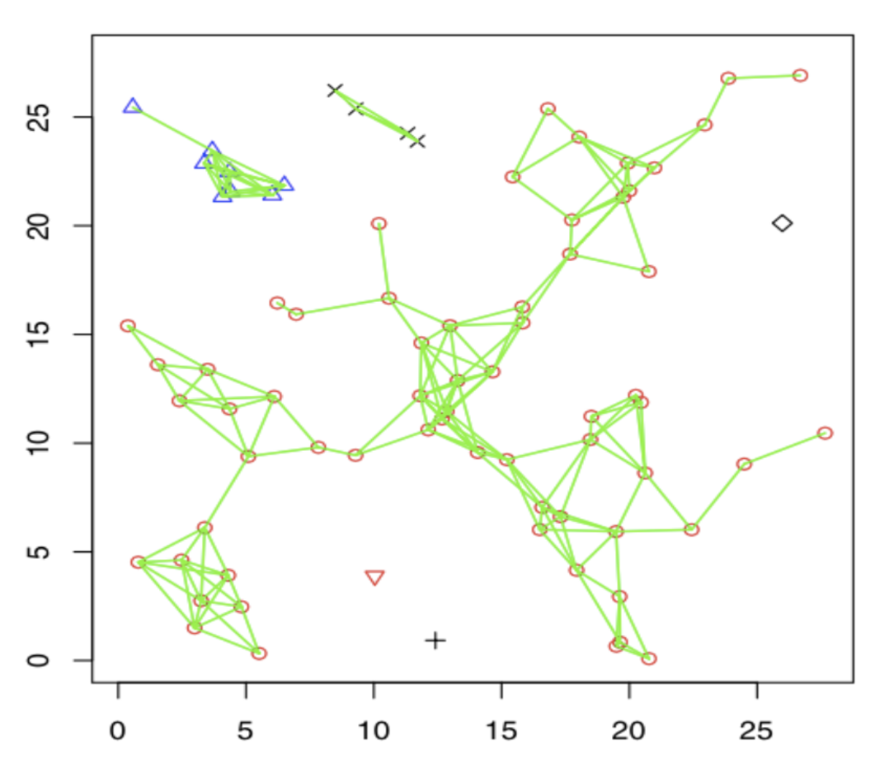
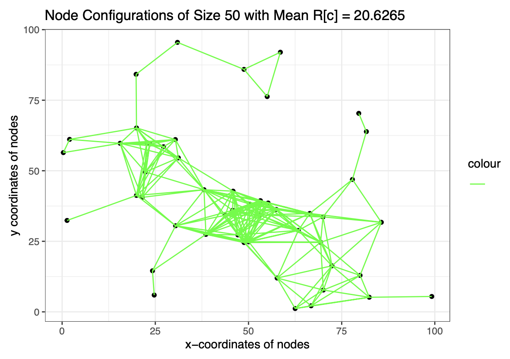
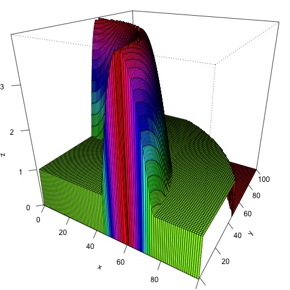

# Ad hoc Network (STAT 302 Final Project)

# What is an Ad hoc Network?

- Nowadays, we rely heavily on our cell phones to receive messages and communicate with others around the world

- Traditionally, these cell phones needed to communicate with a nearby base station in order to send and receive calls

  - More specifically, calls are relayed from base station to base station as our cell phone moves
 
  - This can influence the quality of our phone calls when our cell phones are far away from the nearest base station

- The **ad hoc wireless network** instead relays messages via other devices in the network

  - A message hops from one device to the next until it reaches its destination

  - There are no centralized nodes or fixed structures (such as base stations)
  
  - Devices can dynamically enter and exit the network

## Examples of the Ad Hoc Network

- An **ad hoc wireless network** with 6 disconnected clusters/components

  - *Note that each node corresponds to an arbitrary device in (x, y) space*

  - *Line segments (and the node shape) signify connected nodes in the network*

  - In this case, $R[c] = 3.75$ such that nodes within $3.75 \text{units}$ of each other are connected

- An **ad hoc wireless network** with 0 disconnected clusters/components (fully connected)

  - *Note that each node corresponds to an arbitrary device in (x, y) space*

  - *Line segments signify connected nodes in the network*

  - In this case, $R[c] = 20.6265$ such that nodes within $20.6265 \text{units}$ of each other are connected
 
  - 20.6265 is the minimum line segment length necessary to create a fully connected network

## Connected Ad Hoc Network

- We are interested in those connected networks.
  
- Given a particular configuration of nodes, we want to know the smallest radius $R_c$ that makes a connected network.

- We also want to study the distribution of $R_c$ for different configurations of the nodes.

## Simulation Study for Ad Hoc Network

1. We will randomly generate nodes for an ad hoc network according to some pre-specified node density (generally determined by the geographical information).

## Simulation Study for Ad Hoc Network

1. We will randomly generate $n$ nodes for an ad hoc network according to some pre-specified node density (generally determined by the geographical information). Specifically, we will use the acceptance-rejection algorithm.

- Generate points uniformly in a three-dimensional rectangle.

- If the points fall in the three-dimensional region beneath the density, then we keep them.

- Use the $(x,y)$ coordinates of these accepted points as our sample.

## Simulation Study for Ad Hoc Network

1. We will randomly generate $n$ nodes for an ad hoc network according to some pre-specified node density (generally determined by the geographical information).

2. Find the smallest $R_c$ such that the nodes are connected through paths in the network.

3. Repeat several times for each $n$.

4. Study the distribution of $R_c$.

A more detailed specification is provided in the pdf file below:

[Project Description](https://raw.githubusercontent.com/zhangyk8/zhangyk8.github.io/master/_teaching/file_stat302/Lectures/Final_Project.pdf)

---

## Contributions

- The spec provided me the nodeDensity function alongside the first two test cases.

- I worked on this project alone, so the remaining R code was done by me.

## Learning Outcomes

- Application of the R functions learnt in STAT 302 (ggplot, for loops, while loops, apply functions, etc.).

- Application of linear algebra to produce sparse networks (knowledge of transition matrices, eigenvalues, etc. provided the theoretical backbone for why the algorithm produces a sparse network).
